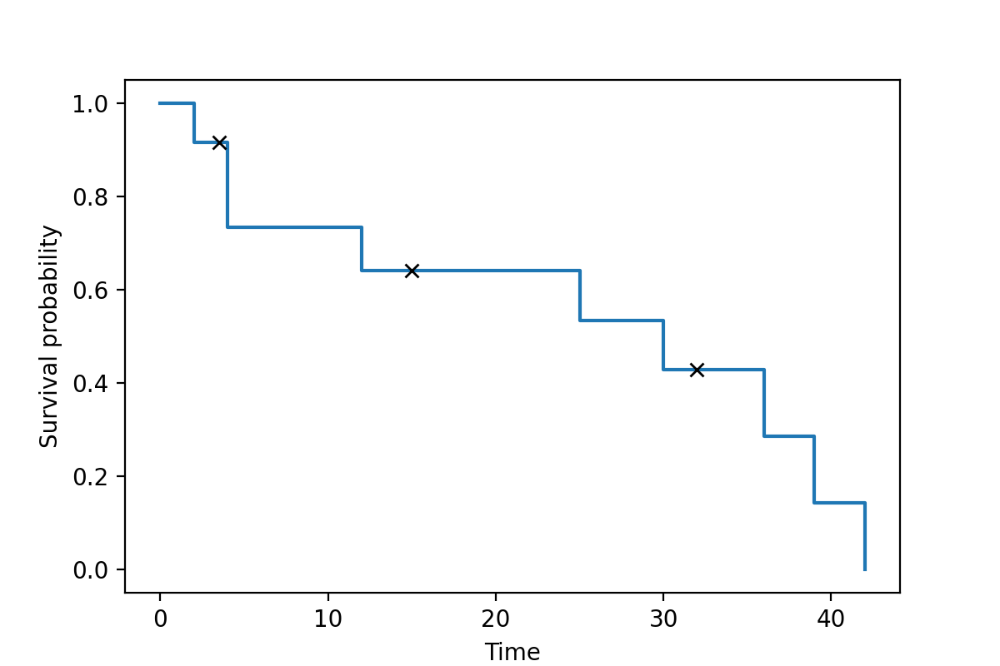
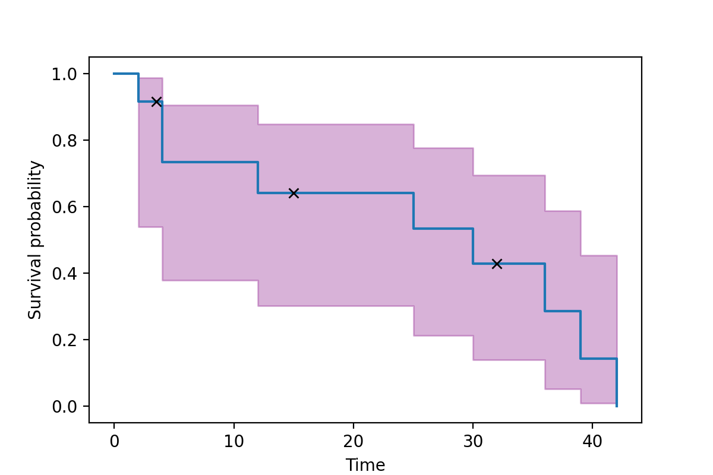
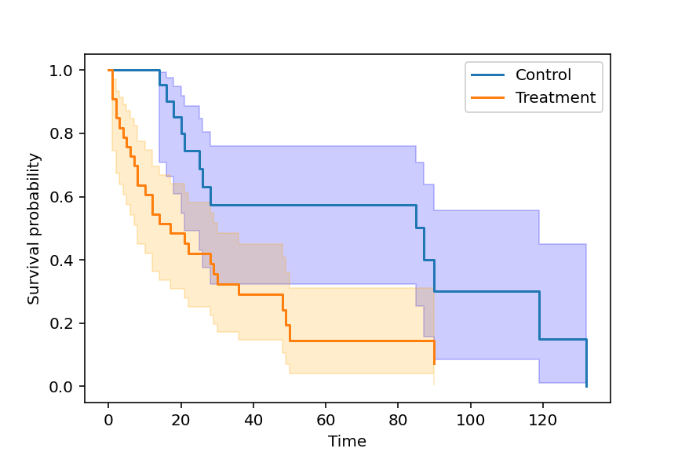

# Survival Analysis functions

This repository contains some Python functionalities 
intended for analysis of survival data (also known as time-to-event data).

There are 3 core functionalities

  * Calculating Kaplan Meier survival curves
  * Comparing two Kaplan Meier suvival curves through the log-rank test
  * Computing hazard ratios (and their confidence intervals) through the Cox proportional hazards model

# Important note

This code was developed for educational purposes. The code favours clarity over efficiency, elegance or brevity.
Some comments in the code refers to lecture notes distributed as part of a course. 
For professional-grade survival software packages, [lifelines](https://github.com/camdavidsonpilon/lifelines) is recommended.


# Sample usage
## Single curve and confidence intervals
```python
import numpy as np
import matplotlib.pyplot as plt
from SurvivalFunctions import kaplan_meier, log_rank_test, cox_prop_haz

time = np.array([2, 3.5, 4, 4, 12, 15, 25, 30, 32, 36, 39, 42]) 
event = np.array([1, 0,  1, 1,  1,  0,  1,  1,  0,  1,  1,  1])#1 is death, 0 is censored 
survival_data = np.column_stack([time, event])
km = kaplan_meier(survival_data)
```
The curve can be visualized (note that it is easy to add "x" at times of censored observations)
```python
plt.figure(1)
plt.xlabel("Time")
plt.ylabel("Survival probability")
plt.plot(km["KM_times_staircase"],km["KM_curve_staircase"])
plt.plot(km["times_censored"], km["s_hat_censored"], 'kx')
```
After calling plt.show()


It is also possible to calculate and visualize confidence intervals. Shown below is the default 95% interval (you may pass alpha=0.01 to the kaplan_meier function for 99% or any value of alpha)
```python
plt.fill_between(km["KM_times_staircase"], km["KM_lower_bound_staircase"], km["KM_upper_bound_staircase"], color='purple', alpha=0.3)
```


## Log-rank test between "treatment" and "control"
Here is an example code
```python
time_control = [14,15,16,18,19,20,21,21,25,26,28,30,60,85,85,86,87,90,\
                            100,119,132]
type_control = [1,0,1,1,0,1,1 ,0 ,1 ,1 ,1 ,0 ,0 ,1 ,0 ,0 ,1 ,1 ,0\
                            ,1 ,1]
control_data = np.column_stack([time_control, type_control])
survival_control = kaplan_meier(control_data)

time_treatment = [1,1,1,2,2,3,4,5,6,7,8,8,10,12,12,14,17,20,21,22,\
                             28,29,30,36,38,40,45,48,49,50,52,90,95]
type_treatment =     [1,1,1,1,1,1,1,1,1,1,1,1,1 ,1 ,1 ,1 ,1 ,0 ,1 ,\
                                 1 ,1 ,1 ,1 ,1 ,0 ,0 ,0 ,1 ,1 ,1 ,0 ,1, 0 ]
treatment_data = np.column_stack([time_treatment,type_treatment])
survival_treatment = kaplan_meier(treatment_data)

log_rank_results = log_rank_test(survival_control, survival_treatment)
print(log_rank_results["p_value"])#0.0244
```
The two curves can be visualized with our without confidence intervals
```python
plt.figure(2)
plt.xlabel("Time")
plt.ylabel("Survival probability")
plt.plot(survival_control["KM_times_staircase"],\
         survival_control["KM_curve_staircase"], label="Control")
plt.plot(survival_treatment["KM_times_staircase"],\
         survival_treatment["KM_curve_staircase"], label="Treatment")
plt.legend()

plt.fill_between(survival_control["KM_times_staircase"],\
         survival_control["KM_upper_bound_staircase"],\
         survival_control["KM_lower_bound_staircase"], color="blue",alpha=0.2)
plt.fill_between(survival_treatment["KM_times_staircase"],\
         survival_treatment["KM_upper_bound_staircase"],\
         survival_treatment["KM_lower_bound_staircase"], color="orange",alpha=0.2)
```


## Calculations of the hazard ratio (Cox proportional hazards model)
The following code would print out the hazard ratio between treatment and control, starting from the same data as the log-rank test example. It is also possible to obtain confidence intervals for the hazard ratio. The code forst "codifies" the control group events with "0" and the treatment group events with "1". then concatenate all the arrays and calls cox_prop_haz function.
```python
control_groups = np.zeros(len((time_control)))
treatment_groups = np.ones((len(time_treatment)))
all_groups = np.concatenate((control_groups,treatment_groups))
all_times = np.concatenate((time_control, time_treatment))
all_types = np.concatenate((type_control,type_treatment))

cox_results = cox_prop_haz(np.column_stack([all_times,all_types]), all_groups)
print(cox_results["hazard_ratios"][0])#2.688
print(cox_results["upper_bounds"][0])#5.496
print(cox_results["lower_bounds"][0])# 1.31
```
